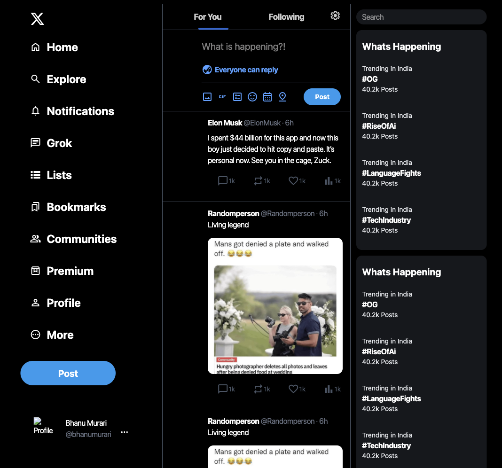

# X-clone-tailwindcss-
this is the clone of the X (twitter) application main page interface

# X (Twitter) Clone - Tailwind CSS UI

A sleek, responsive clone of Twitter's redesigned platform (X) built using **HTML**, **Tailwind CSS**, and **modern UI practices**. This project replicates the core structure of X's main feed, including a sticky header, scrollable content, and responsive layout components.

## 🚀 Features

- ✅ Sticky top navigation bar
- ✅ Responsive and mobile-friendly layout
- ✅ Scrollable main feed area
- ✅ Tailwind CSS utility-first styling
- ✅ Clean and modular HTML structure
- ✅ Easily extendable for JavaScript/React functionality

## 📸 UI Preview

 <!-- Replace with actual screenshot path -->

 

> Includes:
> - Fixed header
> - Scrollable feed
> - Responsive section layouts
> - Placeholder for posts and side widgets

## 🛠️ Tech Stack

| Technology      | Description                          |
|-----------------|--------------------------------------|
| **HTML5**       | Semantic and structured web layout   |
| **Tailwind CSS**| Utility-first CSS for fast styling   |
| **Vite** (optional) | For rapid development workflow |

## 📁 Folder Structure

```
x-clone/
├── index.html
├── style.css (if custom)
├── /public
│ └── assets/
├── tailwind.config.js
└── README.md
```

## 📦 Installation & Setup

### 🧱 Prerequisites

- Node.js (for Tailwind CLI or Vite setup)
- Git

### 📥 Clone the repository

```bash
git clone https://github.com/BhanuSankarasetty/X-clone-tailwindcss-.git
cd X-clone-tailwindcss-
⚙️ Install Tailwind CSS (if not prebuilt)
You can skip this step if you're already using CDN.
```

```
npm install -D tailwindcss
npx tailwindcss init
```

Add this to your tailwind.config.js:

```
module.exports = {
  content: ["./*.html"],
  theme: {
    extend: {},
  },
  plugins: [],
}
```

Then build:

```
npx tailwindcss -i ./input.css -o ./output.css --watch
```

## ▶️ Start the project
Open index.html in a browser or serve using Live Server / Vite:

```
npm install -D vite
npx vite
```

## 📌 Future Improvements
 Add post interactions (like, comment, retweet)

 Add sidebar with trending topics

 Integrate backend API or Firebase

 Convert to React + Tailwind for dynamic UI

